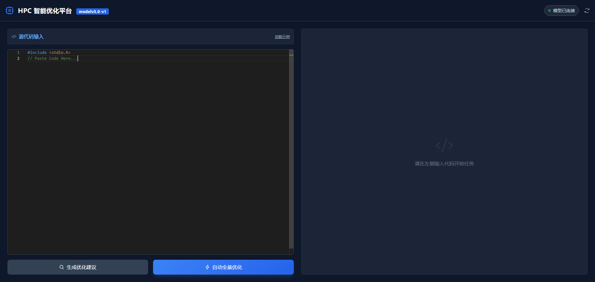

一、数据集准备：
code_improve_dataset/
├──generate_hpc_dataset.py        #LLM生成高质量hpc优化代码数据集
dataset_collect/
├── 1_collect_smart.py
├── 2_clone_robust.py
├── 3_construct_sft_pro.py
├── 3_fix_process_hpc_data.py
├── 4_generate_instruction_dataset.py
├── 5_score_and_filter.py
├── 6_optimize_dataset.py
├── 7_dataset_check.py
├── 8_dataset_clean.py
├── middle_collect/
│   ├── hpc_optimization_dataset.jsonl  #HPC代码优化数据集
│   ├── clone_repository/
│   ├── hpc_dataset_discarded.jsonl
│   ├── hpc_dataset_filtered.jsonl
│   ├── hpc_dataset_final.jsonl
│   ├── hpc_optimization_dataset.json
│   ├── hpc_optimization_dataset_v2.json
│   ├── hpc_finetune_dataset.jsonl
│   ├── hpc_raw_dataset.jsonl
│   ├── hpc_repos_clean.csv
│   ├── hpc_sft_test.jsonl
│   └── hpc_sft_train.jsonl
└── requirements.txt
generate_hpc_dataset.py ：为LLM设定HPC专业身份；基于公认的HPC最佳实践设计主题；要求代码语法正确；包含具体性能问题、明确领域-主题-场景三重约束；随机组合+多场景覆盖，保证数据多样性；最后JSON强制输出+字段验证，确保数据集格式正确、无空缺、不重复。
输出文件：hpc_optimization_dataset.jsonl
1_collect_smart.py ：搜集专注于 HPC (高性能计算)  C++、CUDA、MPI、OpenMP、Fortran、SIMD/AVX 等技术栈的500个工程级项目代码，且满足筛选条件，Star>20,近5年有更新（活跃），非作业和简单教程。
输出文件：hpc_repos_clean.csv
2_clone_robust.py：读取上一步生成的 hpc_repos_clean.csv 文件，获取所有筛选出的仓库地址（URL），调用 Git 命令将代码下载到本地。
输出文件：clone_repository/....
3_fix_process_hpc_data.py：从下载的仓库中提取出“真正有效”的高性能计算代码，并剔除大量的“学生作业空壳”和“伪代码”。
输出文件：hpc_raw_dataset.jsonl
4_generate_instruction_dataset.py：利用大模型（DeepSeek API）的理解能力，采用“逆向工程”的方法，为 HPC 代码自动生成高质量的“指令（Instruction）”。
输出文件：hpc_finetune_dataset.jsonl
5_score_and_filter.py：利用大模型（DeepSeek API）对生成的指令数据集，按照完整性、可执行性、逻辑性等评价标准进行打分，筛选出高质量的数据集，舍弃分数<3的数据集。
输出文件：hpc_dataset_filtered.jsonl（保留）、hpc_dataset_discarded.jsonl（舍弃）
6_optimize_dataset.py：对大模型筛选出来的数据集代码进行清洗和优化，重构代码，确保代码质量。
输出文件：hpc_dataset_final.jsonl
7_dataset_check.py：对处理完成的代码做质量检查，确定数据集格式无误，无数据遗漏、缺失等问题。
8_dataset_clean.py：针对上述检查出的问题，进行最后的数据集优化，得到最终满足要求的、清洗完成的、高质量的数据集。
输出文件：hpc_dataset_final_clean.jsonl
最终得到模型微调使用的数据集文件：hpc_optimization_dataset_v2.json
二、微调实现：
/data/hpc_ft/
├── dataset
|   ├──hpc_optimization_dataset.jsonl   #代码优化微调所用数据集
├── ft_venv/                            #虚拟环境
├── output/
│   ├── hpc_coder_opt_merge/            #完整模型
│   ├── hpc_coder_opt_v2_sft/           #LORA适配器
├── scripts/
|    ├── train_hpc.py                   #微调训练
|    |—— merge_model.py                 #模型合并
|    ├── evaluation_report_opt.txt      #微调过程日志
|    |—— hpc_agent_ultimate.py          #开放微调模型接口api
|    |—— hpc_client_opt.py              #使用模型api测试
/data/vllm_hpc/vllm_models/models--hpcgroup--hpc-coder-v2-6.7b/
├── snapshots/                          #基座模型
|    ├──eaf4335ee4a006389f3bfcf16cc0e09ed93fe4d6

三、系统设计
/data/hpc_ft/
├── scripts/
|    ├── hpc_web_server.py               #后端代码
├── scripts/templates/
|    ├── index.html                      #前端代码

四、系统展示
进入客户端后界面如下：

粘贴需要优化的代码到左侧输入栏，可以选择自动权全量优化和建议优化两种方式。
输入代码：
[图片]
一、自动全量优化
输入代码后点击自动全量优化，等待代码优化过程。
[图片]
代码优化完成后，可以选择下载优化后的代码以及下载优化报告到本地目录。
[图片]
二、建议优化代码
由模型先生成代码优化的建议，可以选择要进行的建议优化方向。
先点击生成优化建议：
[图片]
然后选择建议后点击生成代码。
[图片]
三、代码报告下载演示
[图片]
